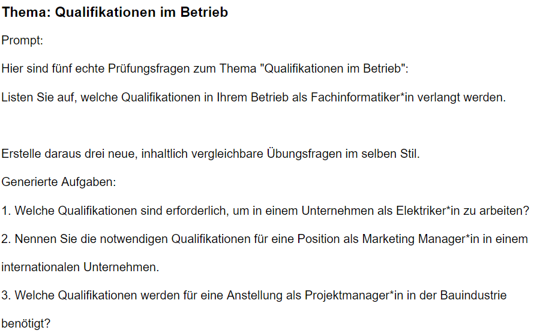

# Prüfungsanalyse-Tool (Statistik + Prognosebasis)

Dieses Projekt ist eine Weiterentwicklung meines [ursprünglichen Analyse-Tools](https://github.com/eneav/Statistikbasierte-Pruefungsprognose).

Aufbauend auf den statistischen Auswertungen aus simulierten Prüfungsarchiven wurde hier ein System entworfen, 
das typische Themen und Aufgabentypen erkennt und darauf basierend neue, realistische Übungsaufgaben generiert. 

Ziel ist es, aus vorhandenen Mustern gezielt neue Aufgabenstellungen abzuleiten, um die Vorbereitung auf Prüfungen praxisnäher (mit struktur) zu gestalten.

## Ziel des Projekts

- Analyse und visualisierung der Aufgabenverteilung (Themen und Typen|ursprüngliches Tool)
- Export CSV-Daten für weitere Verarbeitung in strukturierter Form (/output)
- Aufbau einer statistischen Basis, auf der Vorhersagen künftiger Prüfungsaufgaben möglich werden 
- Dient als Grundlage für ein LLM-Modul, das basierend auf der statistischen Analyse automatisiert Aufgaben und Themenprognosen generieren kann


## Beispielausgaben meines ursprünglichen Analyse-Tools

### Themenverteilung in 10 Prüfungen


### Aufgabentypen in 10 Prüfungen


## Datengrundlage

Die Daten stammen aus 10 simulierten Prüfungen eines bestimmten Fachbereichs(hierbei Prüfung WB). Die JSON-Dateien enthalten jeweils eine Liste von Aufgaben mit den Feldern:

- `thema` – Das übergeordnete Thema der Frage  
- `aufgabentyp` – Zum Beispiel „offene Frage“ oder „multiple choice“  
- `frage` – Die konkrete Aufgabenstellung  
- `antwort` – Eine beispielhafte Musterlösung  


Die Inhalte basieren auf realen Prüfungen, wurden aber leicht abgewandelt (z. B. Synonyme oder Umstellungen), um unterschiedliche Formulierungen bei gleichbleibender Intention zu simulieren. Zusätzlich wurde eine zufällige Varianz von ca. 20-30 % eingebaut, um realistische Abweichungen zu berücksichtigen.

Für die eigentliche Analyse wurden bewusst 10 Prüfungen berücksichtigt, da dies einem typischen Prüfungszeitraum mehrerer Jahrgänge entspricht und somit eine realistische Grundlage für Prognosen bildet.

Im Ordner `data/` befinden sich zusätzlich 50 simulierte Prüfungsdateien, die ein umfangreicheres Archiv abbilden. Sie wurden generiert, um das Analyseverhalten bei größeren Datenmengen zu testen. Damit diese verwendet werden können, muss die Logik im Analyse-Notebook (`notebooks/analyse_aufgaben.ipynb`) entsprechend angepasst werden –


## Nutzung 

1. virtuelle Umgebung aktivieren (empfohlen und nur einmalig):
    ```bash
    python -m venv .venv
    .\.venv\Scripts\activate
    ```

2. Reqs installieren:
    ```bash
    pip install -r requirements.txt
    ```

3. Notebook ausführen (Analyse):
    ```bash
    jupyter notebook notebooks/analyse_aufgaben.ipynb
    ```

4. Notebook ausführen (Aufgabengenerierung):
    ```bash
    jupyter notebook llm_generator/generate_tasks.ipynb
    ```

---


## Skalierbarkeit und Erweiterung

Das Analyse-Tool wurde zunächst für ein einzelnes Fach und 10 Prüfungen umgesetzt. Es lässt sich jedoch leicht erweitern:

- Weitere Fächer und Jahrgänge können ergänzt werden (mehr Daten = genauere Muster)
- Bestehende JSON-Struktur unterstützt automatisierte Verarbeitung
- Die statistische Grundlage kann von einem nachgeschalteten Modul genutzt werden, das auf Basis der gewonnenen Muster künftige Prüfungsaufgaben thematisch und formal vorhersagt

---
---

## LLM-basierte Aufgabengenerierung (Sprachmodell-Ansatz)

Ein wesentlicher Bestandteil dieses Projekts ist der Einsatz eines Large Language Models (LLM), konkret eines gpt-Modells(3.5-turbo)von openai. 

Es wird verwendet, um auf Basis realer Klausuraufgaben neue, thematisch passende Übungsaufgaben zu formulieren. (Neuer Aufbau der Aufgabenstellung, selbe Logik der Antwort wird akzeptiert)

Der LLM erhält eine Auswahl häufiger Themen aus der vorhergehenden Analyse und generiert daraus realistische Fragen, 
die sich in Sprache, Struktur und Inhalt an früheren Prüfungsformaten orientieren. (siehe Statistik der Aufgabentypen und Themenverteilung )

Damit geht das Projekt deutlich über einfache statistische Vorhersagen hinaus: 
Es wird nicht nur gemessen, was häufig vorkommt – sondern das Sprachmodell leitet davon direkt neue, sinnvolle Aufgaben ab.

Die generierten Aufgaben werden im Ordner `llm_generator/generated_tasks/` gespeichert – sowohl als `.json`, als auch als `.pdf`.

---

## Beispielausgabe (PDF)

Nach erfolgreicher Ausführung des Notebooks `generate_tasks.ipynb` wird automatisch eine PDF erzeugt:





[Gesamte PDF im überblick](statistics/beispielausgabe.pdf)

